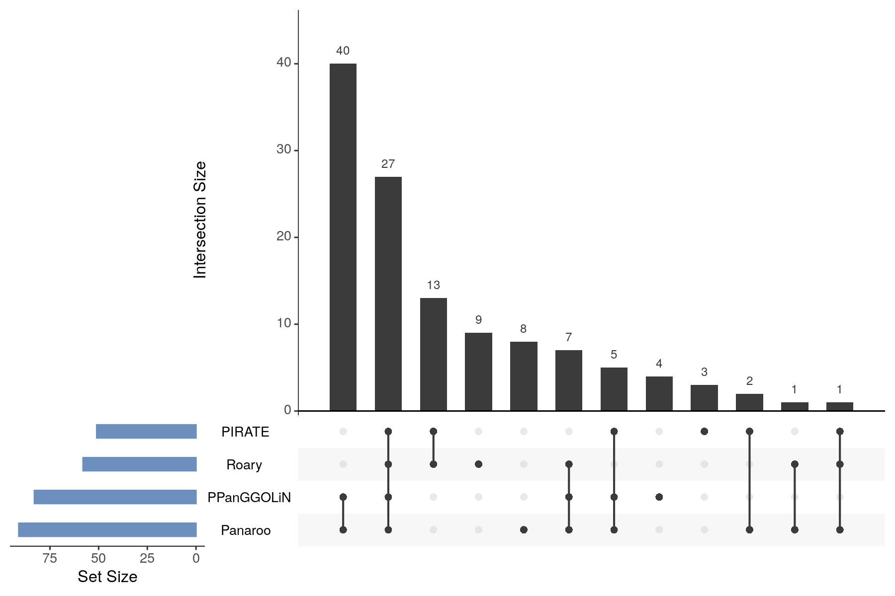
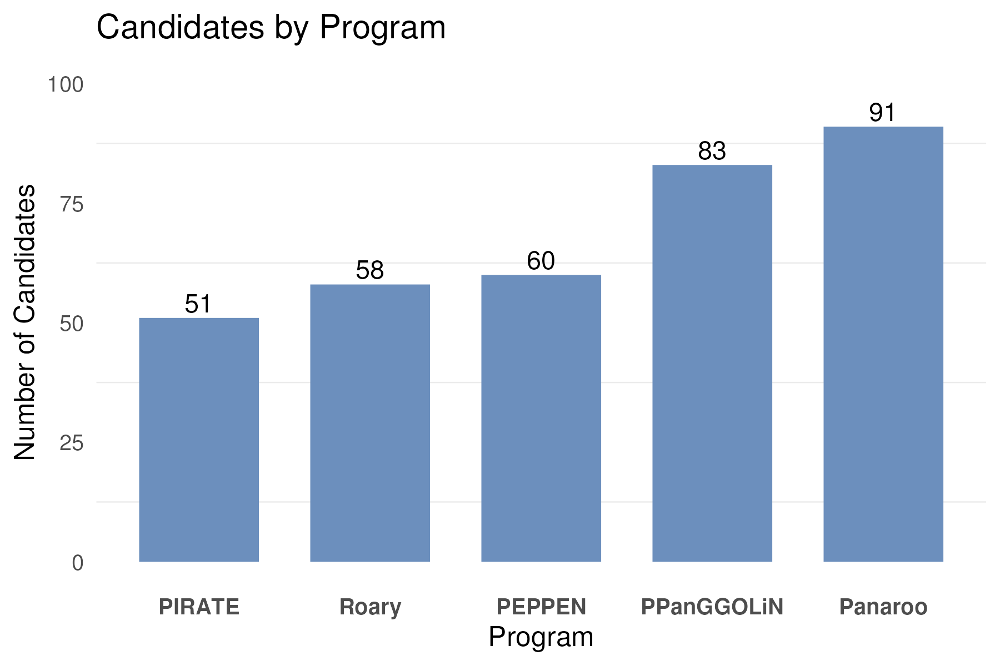

# (Un)CLEAR Task #5: Put Your Own Spin On It
**Morgan Johnston**

Following the core/pan-genome analysis, we decided to compare how our tools did as a group for the poster. We evaluated our pangenome outputs to identify genes as likely candidates for phage host-cell receptors. Myself, Bailey, and Noah all used a script that Bailey wrote for this filtering. There were some edits made to this script on my end to work for my output, but the filtering is the same. This filtering reduced the number of genes for all of us. Following all of us running this script and getting out `final_candidate.csv` output, I compiled all of our files and ran some analysis and made plots to visualize our data. 

  

This UpSet plot does the best at showing out results side by side. We had 27 genes from all of the tools. We originally had more candidates to start with from Panaroo (91) and PPanGGOLiN (83) to start was higher than the other three (~50-60), as shown in the plot below. The upset plot shows the intersection of our tools as well, we had 39 from Panaroo and PPanGGOLiN, and 13 that were from the other three. The difference between these tools could be that Panaroo and PPanGGOLiN were the ones I ran and were the only ones using the full Bakta database but Im not sure. 

  

